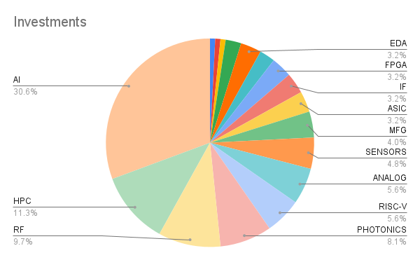

# List of awesome semiconductor startups

## Adding a company:

1. Create a branch
2. Add entry to './startups.csv'
3. Run '$ python ./update.py'
4. Submit a Pull Request

## Submission Guidelines:

* Startup requirements
	* startup (ie not steady state)
	* semi company (ie not application software)
	* product company (ie. not services)
* Alphabetical listing
* Short single sentence description
* All entries must be confirmed with public link
* Max 80 char display width
* Categorize the startup based on technology table below
* Use standard two letter country codes
* Do NOT edit the README directly, it's auto-generated
* Pie-chart is from March 5, 2024 (not auto-generated)

| Technology| Description                                      |
|-----------|--------------------------------------------------|
|ASIC       | Custom silicon
|AI         | AI hardware
|ANALOG     | All things analog
|CHIPLETS   | Chiplet related
|EDA        | Design automation tools
|HEALTH     | Health centric devices
|HPC        | High performance computing
|MEMORY     | Memory
|MEMS       | MEMS based technology
|MFG        | Manufacturing related
|NETWORKING | Various connectivity pieces
|RF         | Wireless
|PHOTONICS  | Photonic based startups
|QUANTUM    | Quantum computing
|RISC-V     | RISC-V based startups
|SECURITY   | Security techhnology
|SENSORS    | Sensing devices
|SPACE      | Space technology

## Startups

| Company | Technology | Founded | Country | Description |
|---------|------------|---------|---------|-------------|
|[Accelercom](https://accelercomm.com) | RF | 2016 | UK |5G physical layer for high-performance networks |
|[Agile Analog](https://agileanalog.com) | EDA | 2017 | UK |Automating design of analog circuitry |
|[Agita Labs](https://agitalabs.com) | SECURITY | 2018 | US |Processing security technology/IP |
|[Aistorm](https://aistorm.ai) | AI | 2011 | US |Charge domain based AI processing |
|[Akhetonics](https://akhetonics.com) | PHOTONICS | 2021 | DE |Optical computing devices |
|[Alif Semiconductor](https://alifsemi.com) | AI | 2019 | US |Integrated SoC for AI at the edge |
|[Allspice.io](https://allspice.io) | EDA | 2018 | US |Design platform for streamlined hardware development |
|[Alpha ICs](https://alphaics.ai) | AI | 2016 | US |AI co-processors for edge devices |
|[Ampere Computing](https://amperecomputing.com) | HPC | 2017 | US |Cloud native manycore CPUs |
|[Anabrid](https://anabrid.com) | ANALOG | 2023 | DE |Analog computer on a chip |
|[Analog Inference](https://analog-inference.com) | AI | 2018 | US |Analog in-memory AI inference accelerators |
|[Analog Photonics](https://analogphotonics.com) | PHOTONICS | 2012 | US |LIDAR and other optical technologies |
|[Andapt](https://andapt.com) | ANALOG | 2014 | IE |Programmable power management ICs |
|[Anello](https://anellophotonics.com) | PHOTONICS | 2018 | US |Photonic based gyroscopes for navigation |
|[Applied Brain Research](https://appliedbrainresearch.com) | AI | 2013 | CA |AI solutions for edge devices |
|[Aspinity](https://aspinity.com) | AI | 2015 | US |Analog in-memory AI inference accelerators |
|[Astera Labs](https://asteralabs.com) | HPC | 2017 | US |High performance connectivity semiconductor solutions |
|[Astrus](https://astrus.ai) | EDA | 2022 | CA |AI platform designed to automate microchip design |
|[Atlantic Quantum](https://atlantic-quantum.com) | QUANTUM | 2022 | US |Scalable quantum computers |
|[Atmosic](https://atmosic.com) | RF | 2016 | US |Battery free wireless devices |
|[Axelera](https://axelera.ai) | AI | 2021 | NL |Low power AI edge processors |
|[Ayar Labs](https://ayarlabs.com) | PHOTONICS | 2015 | US |Electronic-photonic communication chipsets |
|[Baya Systems](https://bayasystems.com) | CHIPLETS | 2023 | US |Chiplet Based Semiconductor Design |
|[Beacon Photonics](https://beaconphotonics) | PHOTONICS | 2023 | US |Integrated photonics platform |
|[Beam](https://beamshaping.io) | RF | 2015 | IL |Phased array antennas |
|[Blaize](https://blaize.com) | AI | 2010 | US |Graph streaming processor for AI applications |
|[Blue Cheetah](https://bcanalog.com) | CHIPLETS | 2018 | US |Rapidly customizable die-to-die interconnect solutions |
|[Bluespec](https://bluespec.com) | RISC-V | 2003 | US |RISC-V IP and System Development Tools |
|[BoolSi](https://boolsi.com) | EDA | 2023 | US |Distributed simulation of synchronous boolean networks |
|[cadlab.io](https://cadlab.io) | EDA | 2015 | US |Collaboration tools for PCB design |
|[Celera](https://celeratechnologies.com) | EDA | 2018 | US |Fully-automated analog/mixed-signal IC development tool. |
|[Celestial AI](https://celestial.ai) | PHOTONICS | 2020 | US |Photonic fabric optical interconnect technoology |
|[Cellium](https://cellium.net) | RF | 2016 | IL |Wireless infrastructurefor indoor connectivity |
|[Celtro](https://celtro.de) | HEALTH | 2019 | DE |Energy harvesting self powering implantable medical devices |
|[Celus](https://celus.io) | EDA | 2016 | DE |PCB design tools |
|[Cerebras](https://cerebras.net) | HPC | 2016 | US |Wafer scale processors |
|[Ceremorphic](https://ceremorphic.com) | HPC | 2020 | US |Analog computing architecture |
|[Cerfe Labs](https://cerfelabs.com) | MFG | 2020 | US |Electronics materials and device research |
|[ChipFlow](https://chipflow.io) | ASIC | 2021 | UK |ASIC design platform |
|[Chipletz](https://chipletz.com) | CHIPLETS | 2021 | US |Smart substrate enabling multiple ICs in a single package |
|[Classiq](https://classiq.io) | EDA | 2020 | IL |Quantum computing software |
|[Codasip](https://codasip.com) | RISC-V | 2014 | DE |Supplier of RISC-V IP cores |
|[Condor Computing](https://condorcomputing.com) | RISC-V | 2023 | US |High performance RISC-V processors |
|[Cornami](https://cornami.com) | HPC | 2011 | US |Configurable acceleration for full homomorphic enctryption |
|[d-Matrix](https://d-matrix.ai) | AI | 2019 | US |Computing platform for datacenter AI infererence |
|[DeGirum](https://degirum.ai) | AI | 2017 | US |AI hardware and software to accelerate AI edge adoption |
|[Dfiant](https://dfiant.works) | EDA | 2022 | US |Chip design tools |
|[Dover](https://dovermicrosystems.com) | SECURITY | 2017 | US |SoC security IP |
|[DreamBig](https://dreambigsemi.com) | CHIPLETS | 2019 | US |Chiplet based ASIC platform |
|[EdgeCortix](https://edgecortix.com) | AI | 2019 | US |AI accelerators for edge devices |
|[EdgeQ](https://edgeq.io) | RF | 2018 | US |Base station-on-a-chip |
|[Efabless](https://efabless.com) | ASIC | 2011 | US |Community powered ASIC platform |
|[Efinix](https://efinixinc.com) | FPGA | 2012 | US |Programmable FPGA products |
|[Eliyan](https://eliyan.com) | CHIPLETS | 2021 | US |Interconnect technology |
|[EnCharge AI](https://enchargeai.com) | AI | 2021 | US |AI processing platform |
|[enzzo](https://enzzo.ai) | EDA | 2024 | US |AI driven hardware development |
|[Eridan](https://eridan.io) | RF | 2013 | US |RF Front End Module for wireless telecommunications |
|[Esperanto](https://esperanto.ai) | HPC | 2014 | US |Manycore RISC-V compute platform |
|[Ethernovia](https://ethernovia.com) | NETWORKING | 2018 | US |In vehicle networking |
|[eTopus](https://etopus.com) | NETWORKING | 2013 | US |High speed interconnect solutions |
|[Evacorp](https://evacorp.ai) | AI | 2023 | US |AI processing  |
|[Exo Imaging](https://exo.inc) | HEALTH | 2015 | US |Handheld ultrasound device |
|[Extropic](https://extropic.ai) | AI | 2022 | US |Physics based generative AI |
|[Fabric Cryptography](https://fabriccryptography.com) | SECURITY | 2021 | US |Cryptography hardware accelerators |
|[Falcomm ](https://myfalcomm.com) | RF | 2021 | US |Solid state power amplifiers |
|[Ferric](https://ferric.com) | ANALOG | 2010 | US |Single-chip power converters |
|[Flex Logix](https://flex-logix.com) | FPGA | 2014 | US |Embedded FPGA IP |
|[Flux](https://flux.ai) | EDA | 2019 | US |PCB design tools |
|[FMC](https://ferroelectric-memory.com) | MFG | 2015 | DE |Ferroelectric non-volatile random access memory technology |
|[Forefrontrf](https://forefrontrf.com) | RF | 2020 | UK |Wireless communication devices |
|[Furiosa](https://furiosa.ai) | AI | 2017 | KR |AI coprocessors |
|[Gemesys](https://gemesys.tech) | AI | 2021 | DE |Analog AI processors |
|[Gowin](https://gowinsemi.com) | FPGA | 2014 | CN |FPGA chip products |
|[GrAI Matter Labs](https://graimatterlabs.ai) | AI | 2016 | FR |Programmable neuromorphic computing chips |
|[Graphcore](https://graphcore.ai) | AI | 2016 | UK |Intelligence processing unit for AI applications |
|[Greenwaves](https://greenwaves-technologies.com) | AI | 2014 | FR |Low power edge AI SoCs |
|[Groq](https://groq.com) | AI | 2016 | US |AI processors |
|[Gyrfalcon](https://gyrfalcontech.ai) | AI | 2017 | US |AI processors |
|[HaiLa](https://haila.io) | RF | 2017 | CA |Low power wireless communication for IoT |
|[Hailo](https://hailo.ai) | AI | 2017 | IL |AI acceleration for edge devices |
|[HawAI.tech](https://hawai.tech) | AI | 2019 | FR |AI accelerators |
|[HyperAccel](https://hyperaccel.ai) | AI | 2023 | KR |AI processors and server solutions for LLM/Gen AI |
|[InCore Semi](https://incoresemi.com) | RISC-V | 2018 | IN |RISC-V IP cores |
|[Ingonyma](https://ingonyma.com) | SECURITY | 2021 | IL |Hardware accelerators for cryptographic computation |
|[Innatera](https://innatera.com) | AI | 2018 | NL |Neuromorphic processors |
|[Ipronics](https://ipronics.com) | PHOTONICS | 2019 | ES |Programmable photonics products |
|[Jeeva Wireless](https://jeevawireless.com) | RF | 2015 | US |Battery-free wireless sensing technology |
|[Jitx](https://jitx.com) | EDA | 2016 | US |PCB design tools |
|[Kandou](https://kandou.com) | NETWORKING | 2011 | CH |Chip-to-chip connectivity solutions |
|[Kepler Computing](https://keplercompute.com) | HPC | 2018 | US |Stealth |
|[Kittycad](https://zoo.dev) | EDA | 2021 | US |AI driven CAD |
|[Kneron](https://kneron.com) | AI | 2015 | US |Edge AI devices |
|[Krutrim](https://olakrutrim.com) | AI | 2023 | IN |AI hardware |
|[Lemurian Labs](https://lemurianlabs.com) | AI | 2018 | CA |AI computing platform |
|[Light Solver](https://lightsolver.com) | PHOTONICS | 2019 | IL |Optical computing platform |
|[Lightelligence](https://lightelligence.ai) | PHOTONICS | 2017 | US |Optical computing platform |
|[Lighton](https://lighton.ai) | PHOTONICS | 2015 | FR |Optical computing platform |
|[Lightmatter](https://lightmatter.co) | PHOTONICS | 2017 | US |Optical computing platform |
|[Luminous Computing](https://luminous.com) | PHOTONICS | 2018 | US |Optical computing platform |
|[Matx](https://matx.com) | AI | 2022 | US |Platform for AGI |
|[MangoBoost](https://mangoboost.io) | HPC | 2022 | US |Data processing units for data center |
|[Memryx](https://memryx.com) | AI | 2019 | US |AI computing platform |
|[Mobilint](https://mobilint.com) | AI | 2019 | KR |AI inference accelerators |
|[Morse Micro](https://morsemicro.com) | RF | 2016 | AU |Low-power Wi-Fi chips |
|[Movellus](https://movellus.com) | ANALOG | 2014 | US |Clock distribution IP |
|[Mythic](https://mythic-ai.com) | AI | 2012 | US |Analog ML accelerators |
|[NcodiN](https://ncodin.com) | PHOTONICS | 2023 | FR |Optical interposers |
|[Neologic](https://neologic.com) | MFG | 2021 | IL |Quasi-CMOS transistor technology |
|[Neureality](https://neureality.ai) | AI | 2019 | IL |Purpose-built AI-centric architecture |
|[NeuroBlade](https://neuroblade.com) | AI | 2018 | IL |Accelerators for high throughput data analytics |
|[Neurophos](https://neurophos.com) | PHOTONICS | 2020 | US |Optical computing platform |
|[Neurxcore](https://neurxcore.com) | AI | 2023 | FR |AI accelerator IP based NVDLA |
|[NextSilicon](https://nextsilicon.com) | HPC | 2017 | IL |High performance computing architecture |
|[Niobium Microsystems](https://niobiummicrosystems.com) | SECURITY | 2021 | US |Secure collection, processing, and distribution of critical data |
|[Novelda](https://novelda.com) | RF | 2004 | NO |Wireless ultra wideband for high resolution impulse radar |
|[Novumind](https://novumind.com) | AI | 2015 | US |Domain specific acceleration for AI applications |
|[OmniDesign](https://omnidesigntech.com) | ANALOG | 2015 | US |Low power analog IP |
|[One Silicon Chip Photonics](https://onesiliconchipphotonics.com) | PHOTONICS | 2016 | CA |Optical chips for precision motion sensing |
|[Optalysys](https://optalysys.com) | PHOTONICS | 2013 | UK |Optical computing next-gen cryptography |
|[Owl](https://owlai.us) | SENSORS | 2018 | US |Monocular 3D thermal ranging solutions |
|[Oxford Quantum Circuits](https://oxfordquantumcircuits.com) | QUANTUM | 2017 | UK |Quantum computing platform |
|[Ozark ICs](https://ozarkic.com) | ANALOG | 2011 | US |High temperature ruggedized electronics |
|[Perceive](https://perceive.io) | AI | 2015 | US |AI processing for edge devices |
|[Phanofi](https://phanofi.com) | PHOTONICS | 2022 | DK |Optical transceivers for data centers & HPCs |
|[Pharrowtech](https://pharrowtech.com) | RF | 2018 | BE |RF ICs for fixed-wireless access and high-capacity wireless links |
|[Picocom](https://picocom.com) | RF | 2019 | UK |Semiconductor products designed for 5G small cell infrastructure. |
|[Pliops](https://pliops.com) | HPC | 2017 | IL |Scalable data handling/acceleration |
|[Polyn Technology](https://polyn.ai) | AI | 2019 | IL |Neuromorphic Analog Signal Processor chips |
|[PQShield](https://pqshield.com) | QUANTUM | 2018 | UK |Hardware co-processors Post-quantum Cryptography |
|[PragmatiC](https://pragmaticsemi.com) | MFG | 2010 | UK |Manufacturer of low-cost flexible integrated circuits |
|[Primemas](https://primemas.com) | CHIPLETS | 2023 | US |SoC infrastructure for accelerated system development |
|[Primis](https://primis.ai) | EDA | 2023 | US |Generative-AI driven hardware design |
|[proteanTecs](https://proteantecs.com) | ANALOG | 2017 | IL |Analytics platform for increasing performance and reliability of electronic systems |
|[PseudolithIC](https://pseudolithic.com) | MFG | 2019 | US |Heterogeneous integration process for RF applications |
|[PsiQuantum](https://psiquantum.com) | QUANTUM | 2015 | US |Quantum computers |
|[Qadric.io](https://quadric.io) | AI | 2016 | US |Edge processing for edge devices |
|[Qualinx](https://qualinx.io) | RF | 2015 | NL |IoT GNSS based tracking and connectivity |
|[Quilter](https://quilter.ai) | EDA | 2020 | US |AI driven PCB design |
|[Rain Neuromorphics](https://rain.ai) | AI | 2017 | US |Brain-inspired hardware for AI applications |
|[Ramon Space](https://ramon.space) | SPACE | 2004 | IL |Computer system designed for computing in space |
|[RapidSilicon](https://rapidsilicon.com) | FPGA | 2021 | US |FPGA devices |
|[rebellions_](https://rebellions.ai) | AI | 2020 | KR |AI processors |
|[Recogni](https://recogni.com) | AI | 2017 | US |Visual perception platform for autonomous vehicles |
|[Redwood EDA](https://redwoodeda.com) | EDA | 2015 | US |Transaction level hardware design platform |
|[Rivos](https://rivosinc.com) | RISC-V | 2021 | US |Stealth |
|[RoboSense](https://robosense.ai) | SENSORS | 2014 | CN |Advanced LiDAR environment perception technologies |
|[Salience Labs](https://saliencelabs.ai) | PHOTONICS | 2020 | UK |Photonic computing platform |
|[SambaNova](https://sambanova.ai) | AI | 2017 | US |AI processing |
|[Saras Micro Devices](https://sarasmicro.com) | MFG | 2021 | US |Packaging solutions for effective power delivery |
|[Scalinx](https://sclinx.com) | RF | 2015 | FR | Wideband RFIC frontends |
|[Scintil](https://scintil-photonics.com) | PHOTONICS | 2018 | FR |Photonic computing platform |
|[Semidynamics](https://semidynamics.com) | RISC-V | 2016 | ES |High performance RISC-V IP cores |
|[Semifive](https://semifive.com) | ASIC | 2019 | KR |ASIC platform |
|[Semify](https://semify-eda.com) | EDA | 2021 | DE |FPGA based platforms |
|[Semron](https://semron.ai) | AI | 2020 | DE |AI processing |
|[SiFive](https://sifive.com) | RISC-V | 2015 | US |RISC-V based IP provider |
|[SiLC](https://silc.com) | PHOTONICS | 2018 | US |Photonics based imaging sensors |
|[Silicon Box](https://Silicon-box.com) | MFG | 2021 | SG |Manufacturer of semiconductor design and device integration services |
|[Silimate](https://silimate.com) | EDA | 2023 | US |Co-pilot for chip designers |
|[SiMa.ai](https://sima.ai) | AI | 2018 | US |AI processing for edge devices |
|[SiPearl](https://sipearl.com) | HPC | 2019 | FR |Manycore processors for EU exascale supercomputing project |
|[Skycore Semiconductors](https://skycore-semi.com) | ANALOG | 2021 | DK |Switched capacitor based integrated power converters |
|[Spark Micro](https://sparkmicro.com) | RF | 2016 | CA |Transceiver technology for ultra-low power wireless communication |
|[Speedata](https://speedata.io) | AI | 2019 | IL |Analytics Processing Unit to accelerate big data and analytics workloads |
|[StarFive](https://starfivetech.com) | RISC-V | 2018 | CN |RISC-V processor core IP and devices |
|[Swave](https://swave.io) | PHOTONICS | 2022 | BE |Holographic chips based on diffractive photonics technology |
|[SWIR Vision Systems](https://swirvisionsystems.com) | SENSORS | 2018 | US |Image sensor technology designed for short-wave infrared cameras |
|[Synthara](https://synthara.ai) | AI | 2020 | CH |In memory computation chips for AI |
|[Syntiant](https://syntiant.com) | AI | 2017 | US |Neuromorphic processing for edge devices |
|[Tachyum](https://tachyum.com) | HPC | 2016 | US |High performance processor architecture |
|[Tenstorrent](https://tenstorrent.com) | ASIC | 2016 | CA |AI processing devices |
|[Teramount](https://teramount.com) | MFG | 2013 | IL |Packaging technology for photonic devices |
|[Tetramem](https://tetramem.com) | AI | 2018 | US |AI accelerator for edge inference |
|[Trameto](https://trameto.com) | ANALOG | 2016 | UK |Energy harvesting PMICs |
|[TriEye](https://trieye.tech) | SENSORS | 2017 | IL |Short-wave infrared imaging systems |
|[Unifabrix](https://unifabrix.com) | NETWORKING | 2020 | IL |CXL based secure connectivity solution |
|[Untether AI](https://untether.ai) | AI | 2018 | CA |AI processing devices |
|[Upmem](https://upmem.com) | AI | 2015 | FR |In memory processsing devices for big data and AI |
|[Usound](https://usound.com) | MEMS | 2012 | AU |Sound solutions based on MEMS technology |
|[Vayyar](https://vayyar.com) | SENSORS | 2011 | IL |High resolution image sensors |
|[Ventana Micro](https://ventanamicro.com) | RISC-V | 2018 | US |RISC-V CPU cores and compute subsystems |
|[VyperCore](https://vypercore.com) | RISC_V | 2022 | UK |RISC-V processors |
|[Xanadu](https://xanadu.ai) | PHOTONICS | 2016 | CA |Photonic based quantum computer |
|[Xsight Labs](https://xsightlabs.com) | HPC | 2017 | IL |Chipsets for accelerating data-intensive workloads |
|[Yorchip](https://yorchip.com) | CHIPLETS | 2023 | US |Chiplet technology |
|[Zendar](https://zendar.io) | SENSORS | 2017 | US |High resolution software defined radar |
|[ZeroASIC](https://zeroasic.com) | CHIPLETS | 2020 | US |Chiplet based ASIC platform |
|[zeroRISC](https://zerorisc.com) | SECURITY | 2023 | US |RoT components |
|[ZeroPoint](https://zeropoint-tech.com) | MEMORY | 2015 | US |Memory compression technology |

## Alumni

| Company |  Exit   | Year   | Value | Link |
|---------| ------- | ------ | ------|------|
|Acacia | IPO | 2016 | $1B | [Source](https://www.bizjournals.com/boston/news/2016/12/29/the-best-performing-ipo-nationwide-of-2016-is.html) |
|Agnilux | Google | 2010 | N/A | [Source](https://techcrunch.com/2010/04/20/google-agnilux-apple) |
|Alphawave | IPO | 2021 | $4.3B | [Source](https://www.marketwatch.com/story/chip-maker-alphawave-set-for-4-3-billion-london-ipo-after-shunning-the-nasdaq-11620840007) |
|Altair Semiconductor | Sony | 2016 | $212M | [Source](https://www.jvpvc.com/case-studies/altair/) |
|Ambric | Shutdown | 2008 | $0 | [Source](https://www.oregonlive.com/siliconforest/2008/11/ambric_suspends_operation_plan.html) |
|Annapurna Labs | Amazon | 2015 | $375M | [Source](https://www.extremetech.com/computing/198140-amazon-buys-secretive-chip-maker-annapurna-labs-for-350-million) |
|Anobit | Apple | 2012 | $500M | [Source](https://techcrunch.com/2012/01/11/why-apple-bought-anobit) |
|Aquantia | Marvell | 2019 | $452M | [Source](https://www.thestreet.com/investing/earnings/marvell-technology-to-purchase-aquantia-14949381) |
|Arbe | IPO | 2021 | $525M | [Source](https://en.globes.co.il/en/article-arbe-robotics-lists-on-nasdaq-friday-as-spac-merger-completed-1001386505) |
|Banias | Alphawave | 2022 | $240M | [Source](https://www.calcalistech.com/ctechnews/article/hynfz2sxs) |
|BrainChip | IPO | 2011 | N/A | [Source](https://finance.yahoo.com/quote/BRN.AX/) |
|Calxeda | Shutdown | 2013 | $0 | [Source](https://semiengineering.com/chip-startup-shuts-doors/) |
|Cambricon | IPO | 2020 | $5B | [Source](https://techcrunch.com/2020/06/24/chip-cambricon-ipo/) |
|Diakopto | Ansys | 2023 | N/A | [Source](https://www.prnewswire.com/news-releases/ansys-signs-definitive-agreement-to-acquire-diakopto-expands-multiphysics-simulation-portfolio-for-semiconductor-designers-301826540.html) |
|Espressif | IPO | 2017 | $1.8B | [Source](https://www.cnx-software.com/2019/07/25/espressif-systems-gets-listed-on-the-shanghai-stock-market/) |
|Fungible | Microsoft | 2023 | $190M | [Source](https://blogs.microsoft.com/blog/2023/01/09/microsoft-announces-acquisition-of-fungible-to-accelerate-datacenter-innovation/) |
|GaN Systems | Infineon | 2023 | $830M | [Source](https://www.infineon.com/cms/en/about-infineon/press/press-releases/2023/INFXX202303-073.html) |
|Genapsys | Shutdown | 2022 | $0 | [Source](https://cases.ra.kroll.com/genapsys/Home-Index) |
|Habana Labs | Intel | 2019 | $2B | [Source](https://www.forbes.com/sites/moorinsights/2019/12/16/intel-acquires-habana-labs-for-2b/?sh=27bc9bc319f9) |
|Indie Semiconductor | SPAC | 2020 | $1.4B | [Source](https://www.marketwatch.com/story/indie-semiconductor-to-go-public-through-spac-buyout-deal-that-values-company-at-14-billion-2020-12-15) |
|Innovium | Marvell | 2021 | $1.1B | [Source](https://techcrunch.com/2021/08/03/marvell-nabs-innovium-for-1-1b-as-it-delves-deeper-into-cloud-ethernet-switches/) |
|Innoviz | SPAC | 2021 | 371M | [Source](https://www.prnewswire.com/news-releases/innoviz-technologies-and-collective-growth-corporation-announce-closing-of-business-combination-301262031.html) |
|Kalray | IPO | 2018 | $100M | [Source](https://www.euronext.com/en/about/media/euronext-press-releases/kalray-sintroduit-sur-euronext-growth) |
|Lucata |  Shutdown | 2024 |  n/a | [Source]( https://www.linkedin.com/posts/marty-deneroff-2a554_sadly-lucata-emu-technology-ceased-operations-activity-7168985090331500544-xy_D) |
|Kameleon | Ramon Space | 2022 | N/A | [Source](https://www.startuphub.ai/ai-exit-events/ramon-space-merges-with-kameleon/) |
|Mathstar | Shutdown | 2008 | $0 | [Source](https://www.oregonlive.com/business/2008/05/mathstar_calls_it_quits.html) |
|Minima | Acquired | NA | NA | [Source](https://www.acuity.co.uk/successes/acuity-advises-minima-on-its-sale-to-bosch/) |
|MixComm | Sivers | 2021 | $155M | [Source](https://www.eetimes.com/mixcomm-acquired-by-sivers-semiconductors/) |
|Mobix Labs | SPAC | 2023 | N/A | [Source](https://mobixlabs.com) |
|Movidius | Intel | 2016 | $400M | [Source](https://siliconangle.com/2016/09/06/intel-buys-movidius-to-boost-machine-vision/) |
|Nervana | Intel | 2016 | $350M | [Source](https://venturebeat.com/2016/08/09/intel-acquires-deep-learning-startup-nervana) |
|Nuvia | Qualcomm | 2021 | $1.4B | [Source](https://www.fiercewireless.com/devices/qualcomm-to-acquire-nuvia-for-1-4b) |
|Occuli | Ambarella | 2021 | $307M | [Source](https://www.ambarella.com/news/ambarella-closes-acquisition-of-oculii/) |
|PA Semi | Apple | 2009 | $278M | [Source](https://www.cnet.com/tech/tech-industry/apple-acquires-low-power-chip-designer-pa-semi) |
|Pensando | AMD | 2022 | $1.9B | [Source](https://www.amd.com/en/press-releases/2022-05-26-amd-expands-data-center-solutions-capabilities-acquisition-pensando) |
|PrimeSense | Apple | 2013 | $350M | [Source](https://techcrunch.com/2013/11/24/apple-primesense-acquisition-confirmed) |
|Provigent | Broadcom | 2011 | $360M | [Source](https://en.globes.co.il/en/article-1000631723) |
|SiByte |  Broadcom | 2000 |  $2B | [Source](https://www.eetimes.com/broadcom-acquires-mips-core-provider-sibyte) |
|SiCortex | Shutdown | 2009 | $0 | [Source](https://www.bizjournals.com/boston/blog/mass-high-tech/2009/05/supercomputer-firm-sicortex-closes-doors.html) |
|Soft Machines | Intel | 2016 | $250M | [Source](https://www.theregister.com/2016/09/09/intel_soft_machines/) |
|Stream Processors | Shutdown | 2009 | $0 | [Source](https://venturebeat.com/2009/11/07/chip-design-firm-stream-processors-shutting-down-and-selling-assets/) |
|Tabula | Shutdown | 2015 | $0 | [Source](https://semiwiki.com/fpga/4232-tabula-closes-its-doors/) |
|Tensil.ai | N/A | N/A | N/A | NA |
|Tilera | Ezchip | 2014 | $50M | [Source](https://www.prnewswire.com/news-releases/ezchip-completes-acquisition-of-tilera-a-leader-in-high-performance-multi-core-processors-281754771.html) |
|Upverter | Altium | 2017 | $2.8M | [Source](https://pitchbook.com/profiles/company/56161-81#overview) |
|Wavious | Shutdown | 2022 | $0 | [Source](https://pitchbook.com/profiles/company/169888-60#overview) |
|zGlue | Sold | 2021 | N/A | [Source](https://www.reuters.com/technology/chip-wars-how-chiplets-are-emerging-core-part-chinas-tech-strategy-2023-07-13) |
