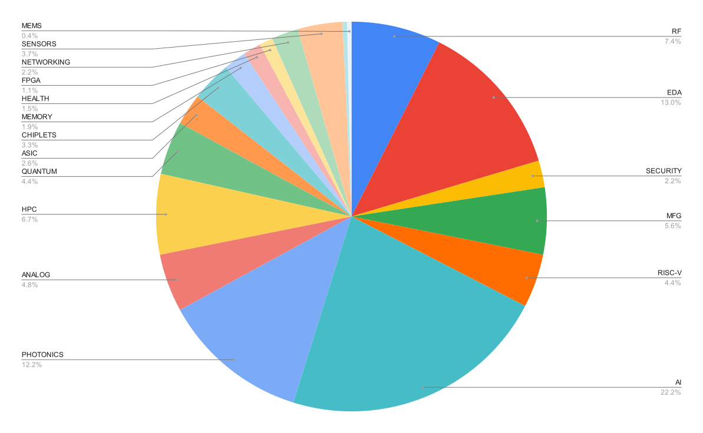
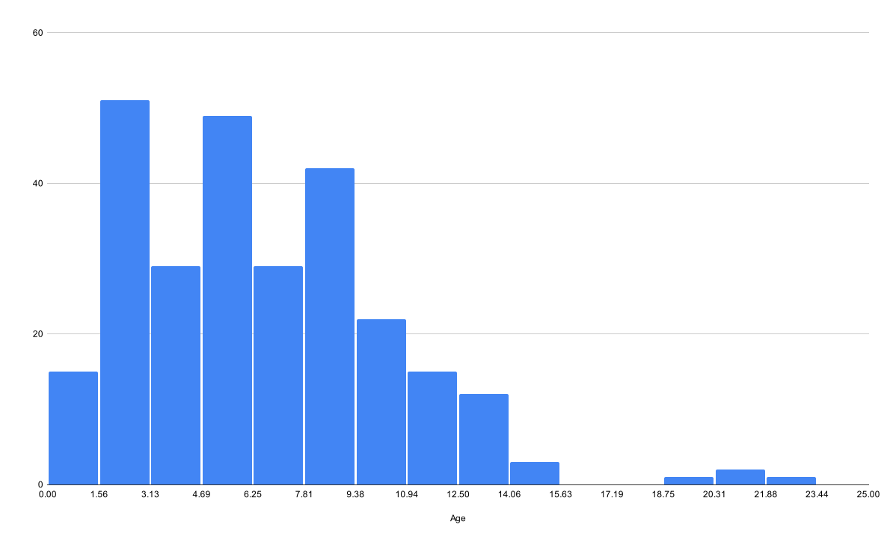

# Database of Awesome Semiconductor Startups

[](https://doi.org/10.5281/zenodo.20466138)

## Citation:

If you use this repository in research, articles, presentations, or market analyses, please cite:

> Andreas Olofsson. *Database of Awesome Awesome Semiconductor Startups*.
> GitHub repository.
> https://github.com/aolofsson/awesome-semiconductor-startups

BibTeX:

```bibtex
@misc{olofsson_awesome_semiconductor_startups,
  author = {Andreas Olofsson},
  title = {Database of Awesome Semiconductor Startups},
  year = {2026},
  howpublished = {\url{https://github.com/aolofsson/awesome-semiconductor-startups}}
}
```

## Adding a company:

1. Create a branch
2. Add entry to './startups.csv'
3. Run '$ python ./update.py'
4. Submit a Pull Request

## Submission Guidelines:

* Startup requirements
	* startup (ie not steady state)
	* semi company (ie not application software)
	* product company (ie. not services)
* Alphabetical listing
* Short single sentence description
* No Performance claims in description!
* All entries must be confirmed with public link
* Max 80 char display width
* Categorize the startup based on technology table below
* Use standard two letter country codes
* Do NOT edit the README directly, it's auto-generated
* Plots were manually extracted 02/2025 (not auto-generated)

## Category Distribution (270 samples, 02/2025)


## Age Distribution



## Categories
